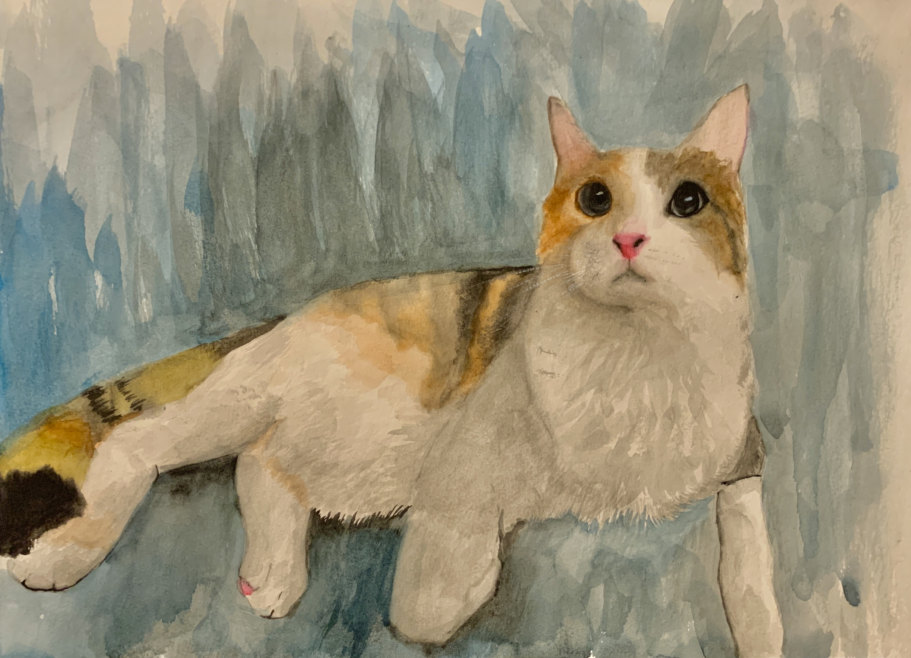

## About Me

---

Starting from age 6, Sophia started her drawing career with a simple 4B pencil and a reference picture. Soon, she would adopt a paintbrush and begin her painting career. Continuing to take art lessons from the Meilin Art Studio and Advanced Art in school, she continues to work hard refining her art skills. 

Starting Sophomore year of highschool, her friend's birthday was inching near, and Sophia didn't know what to do. However, in a moment of desperation, she remembered her friend's most adored cat, April, Sophia found a picture of april and began drawing her friend's most adored cat. With the finsihed result, it was framed and given to her friend, who loved it. After seeing her friend's overjoyed reaction, Sophia realized that this is the type of joy she wishes to gift to her community. 

<!-- Required image to be in same directory that's why image in this file -->

After that day, she began to practice her drawing skills of all sorts of animals with a wide range of materials such as:

1. Acrylic paint
2. Chinese paint
3. Watercolor 
4. Charcoal 
5. Pencils

Of course, she is overjoyed to try any new medias for anyone who wishes to see their pet drawn in that media. 

Later on, as she continued through her years in highschool, her passion for coding began to bloom. She began learning computer science, working with GitHub, and website managing. 

She's tried to implement her passion through website managment with a local community origanization, ***The 8 Foundation***, 